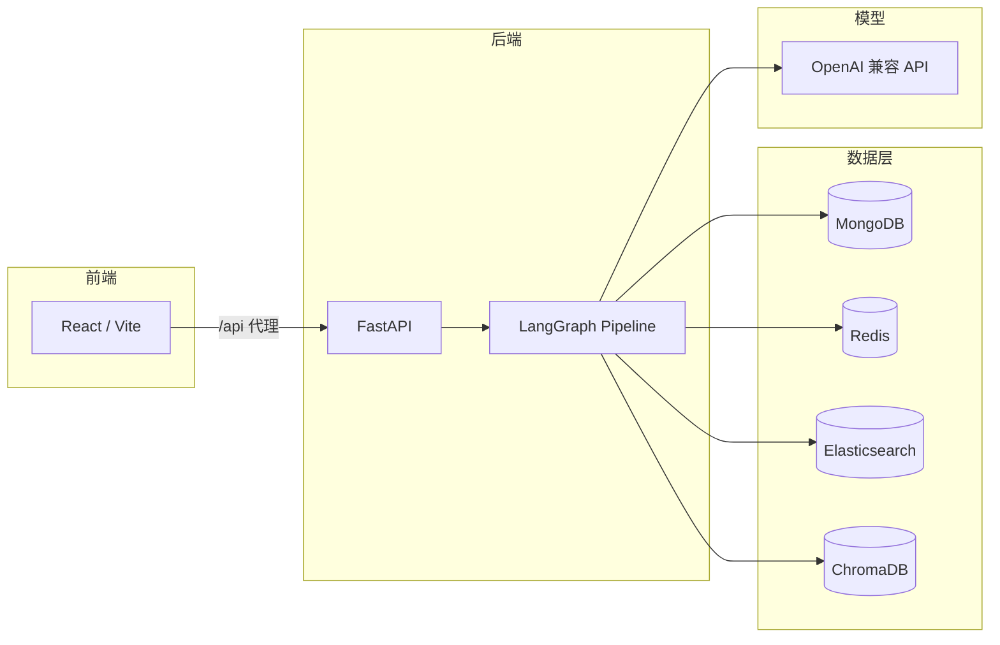

# 求职顾问（Job Advisor）

面向求职场景的智能顾问系统：结合大模型编排、职位 / 简历 / 事实数据与用户对话，提供可执行的子任务规划、工具调用与多端展示。

---

## 一、系统架构

### 1.1 总体分层

| 层级 | 技术栈 | 职责 |
|------|--------|------|
| 前端 | React 18 + TypeScript + Vite | 职位卡片与详情、简历与事实展示、对话智能体、SSE 通知 |
| 后端 API | FastAPI | REST 接口、依赖注入、CORS |
| 智能体编排 | LangGraph + LangChain | 对话流水线：Triage → Plan → Review → Executor |
| 数据与缓存 | MongoDB、Redis、Elasticsearch、Chroma | 业务持久化、短期对话、事实检索（BM25 + 向量） |

### 1.2 后端核心流水线

单轮用户输入经 **AdvisorPipeline** 处理，大致流程为：

1. **Triage**：判断是否归属近期主任务，必要时新建 `Task`。
2. **Plan**：基于用户输入、历史、事实与工具定义，生成子任务（槽位解析、澄清、事实确认等）。
3. **Review**：执行待处理的子任务（如澄清补参、事实确认状态机、工具结果缓存等）。
4. **Executor**：生成助手回复，并可异步抽取 / 更新事实。

对话短期历史写入 **Redis List**（按 `user_id`、条数与 TTL 限制）；同一条消息可双写到 **MongoDB** 供长期查询（如聊天历史接口）。

### 1.3 外部依赖关系（示意）



---

## 二、业务说明

### 2.1 目标用户场景

- 管理**求职意向相关的结构化事实**（地点、薪资、工作方式、技能画像、约束等）。
- 浏览与管理**职位**（与公司、biz_id、状态等关联）。
- 查看与维护**简历**画像。
- 通过**对话智能体**自然语言交互，由系统规划子任务并调用顾问工具（如职位搜索等）。

### 2.2 核心业务对象（简述）

- **任务与子任务**：主任务对应一次会话脉络；子任务类型包括工具槽位、槽 Clarify、事实确认等，便于分步执行与状态跟踪。
- **事实（Fact）**：以 ES 为主存储、Chroma 做向量检索；支持页面批量写入与后端合并更新。
- **对话历史**：Redis 侧重近期上下文；Mongo 可沉淀历史记录供 API 拉取（具体策略以当前 `DialogueHistoryStorage` 实现为准）。
- **通知**：进程内 SSE Hub，可按 `user_id` 推送前端提示。

### 2.3 主要 API 领域（前缀均为 `/api`）

- **chat**：对话轮次、历史、流式 NDJSON 等。
- **jobs / user_jobs**：职位与用户职位状态。
- **resume**：简历读写。
- **facts**：事实列表、检索、批量写入与后端更新。
- **notify**：用户通知推送与 SSE。

---

## 三、启动方式

### 3.1 前置条件

- **Python** ≥ 3.11，推荐使用 **[uv](https://github.com/astral-sh/uv)** 管理后端依赖。
- **Node.js**（建议 18+）与 **pnpm / npm**，用于前端。
- 本地或可访问的 **MongoDB、Redis、Elasticsearch、Chroma**；端口与库名需与配置一致（见下节环境变量）。

### 3.2 环境变量（后端）

在 **`backend_job_advisor/.env`** 中配置（与 `config/base_conifg.py`、`config/llm_config.py` 对齐），至少包括：

- 数据库与中间件：`MONGODB_URI`、`MONGODB_DB`、`REDIS_URL`、`ELASTICSEARCH_URL`、Chroma 主机与端口等。
- LLM：`OPENAI_API_KEY` 及模型相关变量（以 `llm_config` 为准）。
- 可选：`API_PORT`（默认 **8001**）。

### 3.3 启动后端

在目录 **`backend_job_advisor`** 下执行：

```bash
cd backend_job_advisor
uv sync
```

任选其一启动 HTTP 服务：

```bash
# 开发热重载（示例端口与 main 注释一致时可改）
uv run uvicorn main:app --app-dir src --reload --host 0.0.0.0 --port 8001
```

或直接：

```bash
uv run python src/main.py
```

（端口取自 `Settings().api_port`，默认 8001。）

健康检查可访问：`GET http://127.0.0.1:8001/api/deps/ping`（需在四类存储就绪时）。

### 3.4 启动前端

```bash
cd front_job_advisor
pnpm install
pnpm dev
```

默认开发地址：**http://localhost:5173**。  
Vite 已将 **`/api` 代理到 `http://127.0.0.1:8001`**，因此前端请求 `/api/...` 会转发到后端；后端 CORS 已允许 `localhost:5173`。

生产构建：

```bash
pnpm run build
pnpm run preview
```

### 3.5 目录结构速览

```
job_advisor/
├── backend_job_advisor/   # FastAPI + LangGraph 后端（源码在 src/）
├── front_job_advisor/     # React + Vite 前端
└── readme                 # 本说明
```

---

## 四、开发与测试（可选）

- 后端单元测试（示例配置在 `pyproject.toml`）：

  ```bash
  cd backend_job_advisor
  uv run pytest
  ```

如需与设计文档或 `.env.example` 对齐的细节，请以仓库内对应文件为准。
